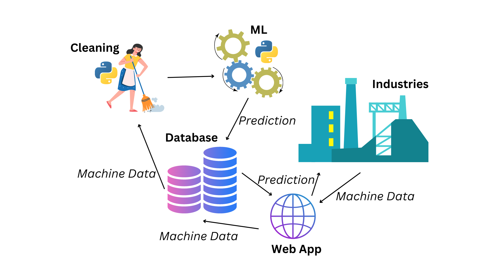
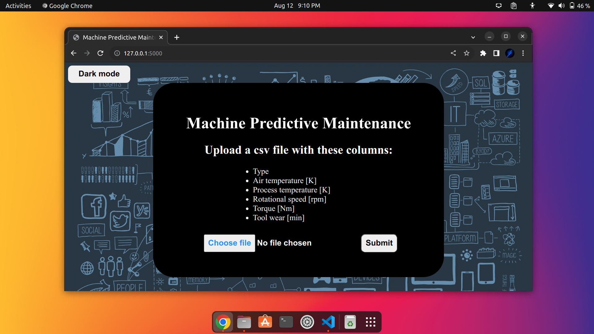
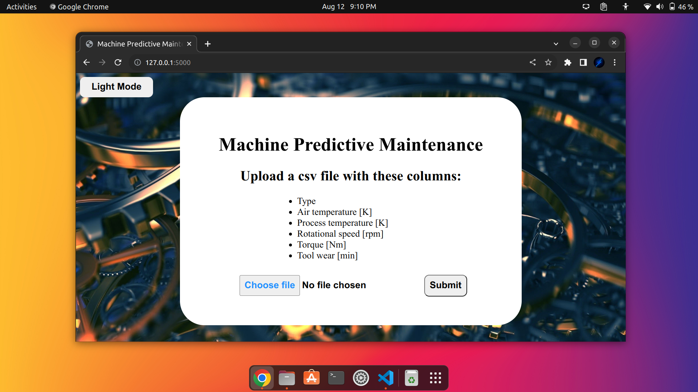

# Machine Predictive Maintenance for Industrial Machines

## About

Predictive maintenance (PdM) is a maintenance strategy that uses data analysis to predict when a machine or equipment is likely to fail. This allows for preventive maintenance to be performed before the failure occurs, avoiding costly downtime and repairs. By combining PdM with ML, it is possible to develop models that can accurately predict machine failures days, weeks, or even months in advance. This allows organizations to schedule preventive maintenance at the most opportune time, minimizing downtime and maximizing uptime.



## Download Repository

```
git clone --depth 1 https://github.com/UdAyAn123/Predictive_Maintain
```

## Change directory

```
cd Machine-Predictive-Maintenance
```

## Create virtual environment

```
python -m venv .venv
```

## Activate virtual environment

For windows
```
.venv/Scripts/activate 
```

For linux
```
source .venv/bin/activate
```

## Install requirements

```
pip install -r requirements.txt
```

## Train

Run `train.py` this will train the model and save the models into `models` folder

```
python myapp/modules/train.py
```

## Test

Run `test.py` to verify saved models work well

```
python myapp/modules/test.py
```

## App

Run web app

```
python manage.py runserver 5000
```


Dark mode:



Light mode:


